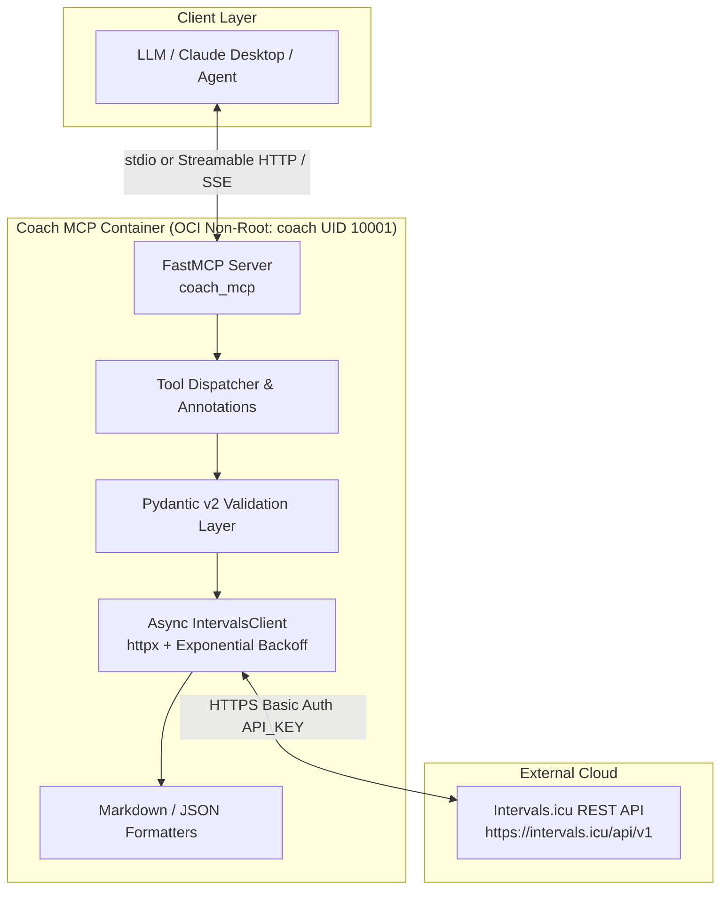

# Coach MCP Server 🚴‍♂️🏋️‍♂️

[](https://www.gnu.org/licenses/gpl-3.0)
[](https://www.python.org/downloads/)
[](https://modelcontextprotocol.io)
[-success.svg)](https://opencontainers.org)

**Coach MCP** is a production-grade Model Context Protocol (MCP) server that empowers Large Language Models (LLMs) to act as intelligent, data-driven endurance sports coaches by interacting seamlessly with the **Intervals.icu** REST API.

---

## 🏛️ System Architecture



---

## 🚀 Key Capabilities

1. **Athlete & Physiology Profiling**:
   - Query athlete details, weight, resting HR, and max HR (`intervals_get_athlete_profile`).
   - Retrieve sport settings, FTP, threshold heart rate (LTHR), and training zones (`intervals_get_sport_settings`).
2. **Activity & Workout Analytics**:
   - List historical workouts with power, HR, and training load (`intervals_list_activities`).
   - Retrieve in-depth metrics: NP, IF, TSS, aerobic/anaerobic training effect (`intervals_get_activity`).
   - Fetch second-by-second sensor streams (watts, cadence, HR, altitude) (`intervals_get_activity_streams`).
   - Inspect detected work/recovery intervals (`intervals_get_activity_intervals`).
   - Record manual activities and update subjective metrics (RPE, feel) (`intervals_create_activity`, `intervals_update_activity`).
3. **Recovery, Wellness & Fitness Metrics (Banister Model)**:
   - Track daily HRV (rMSSD), resting heart rate, sleep duration & quality (`intervals_get_wellness`, `intervals_record_wellness`).
   - Calculate Chronic Training Load (**CTL** / Fitness), Acute Training Load (**ATL** / Fatigue), and Training Stress Balance (**TSB** / Form) (`intervals_get_fitness_summary`).
4. **Workout Planning & Structured Workout Creation**:
   - Query scheduled workouts on the athlete calendar (`intervals_list_events`).
   - Schedule structured workouts using Intervals.icu workout DSL (`intervals_create_event`, `intervals_update_event`, `intervals_delete_event`).
5. **Workout Library Management**:
   - Explore folders and reusable workout templates (`intervals_list_folders`, `intervals_list_workouts`).

---

## 🔒 Security & OCI Non-Root Execution

- **Non-Root Execution**: Runs as unprivileged user `coach` (`UID:GID 10001:10001`).
- **Clean Transport Channel**: All application logging is directed exclusively to `stderr`, keeping `stdout` unpolluted for clean stdio JSON-RPC framing.
- **Zero Hardcoded Secrets**: Fully configurable via environment variables.

---

## ⚙️ Configuration

Create a `.env` file or supply environment variables:

| Variable | Description | Default |
| :--- | :--- | :--- |
| `INTERVALS_API_KEY` | Your Intervals.icu API Key (Settings -> Developer Settings) | *Required* |
| `INTERVALS_ATHLETE_ID` | Athlete ID (`0` for self, or `iXXXXX` for coached athlete) | `0` |
| `INTERVALS_BASE_URL` | Base API URL | `https://intervals.icu/api/v1` |
| `MCP_TRANSPORT` | Server transport mode: `stdio` or `streamable_http` | `stdio` |
| `MCP_HOST` | Host address for HTTP / SSE transport | `0.0.0.0` |
| `MCP_PORT` | Port for HTTP / SSE transport | `8000` |
| `HTTP_TIMEOUT_SECONDS`| API request timeout in seconds | `30.0` |
| `HTTP_MAX_RETRIES` | Max retries with exponential backoff on 429/5xx | `3` |

---

## 🐳 Docker Deployment

### 1. Build OCI Container
```bash
docker build -t coach-mcp .
```

### 2. Run with Stdio (Local Subprocess)
```bash
docker run -i --rm \
  -e INTERVALS_API_KEY="your_api_key" \
  -e INTERVALS_ATHLETE_ID="0" \
  coach-mcp
```

### 3. Run with Streamable HTTP / SSE (Remote Server)
```bash
docker run -d --rm \
  -p 8000:8000 \
  -e MCP_TRANSPORT="streamable_http" \
  -e MCP_PORT="8000" \
  -e INTERVALS_API_KEY="your_api_key" \
  -e INTERVALS_ATHLETE_ID="0" \
  --name coach-mcp-server \
  coach-mcp
```

---

## 📦 GitHub Container Registry (GHCR)

Pre-built OCI images are published to the GitHub Container Registry for every push to `dev`, every merged pull request to `qa` or `main`, and on-demand via `workflow_dispatch`.

### Available Tags

| Trigger | Tags |
| :--- | :--- |
| Push to `dev` | `ghcr.io/fpittelo/coach:dev`, `ghcr.io/fpittelo/coach:<sha>` |
| PR merged to `qa` | `ghcr.io/fpittelo/coach:qa`, `ghcr.io/fpittelo/coach:<sha>` |
| PR merged to `main` | `ghcr.io/fpittelo/coach:latest`, `ghcr.io/fpittelo/coach:prod`, `ghcr.io/fpittelo/coach:<sha>` |
| `workflow_dispatch` | `ghcr.io/fpittelo/coach:<environment>`, `ghcr.io/fpittelo/coach:<sha>` (and `latest` for `prod`) |

### Pull the Image

```bash
# Pull the latest production image
docker pull ghcr.io/fpittelo/coach:latest

# Pull a specific environment image
docker pull ghcr.io/fpittelo/coach:dev

# Pull a specific commit
docker pull ghcr.io/fpittelo/coach:<sha>
```

### Run the GHCR Image

```bash
# Stdio mode
docker run -i --rm \
  -e INTERVALS_API_KEY="your_api_key" \
  -e INTERVALS_ATHLETE_ID="0" \
  ghcr.io/fpittelo/coach:latest

# Streamable HTTP / SSE mode
docker run -d --rm \
  -p 8000:8000 \
  -e MCP_TRANSPORT="streamable_http" \
  -e MCP_PORT="8000" \
  -e INTERVALS_API_KEY="your_api_key" \
  -e INTERVALS_ATHLETE_ID="0" \
  --name coach-mcp-server \
  ghcr.io/fpittelo/coach:latest
```

### GHCR Token Permissions

The `deploy.yaml` workflow authenticates to GHCR using the repository-scoped `GITHUB_TOKEN`. The workflow declares the minimum required permissions:

```yaml
permissions:
  contents: read
  packages: write
```

- `contents: read` is required to check out the repository.
- `packages: write` is required to push images to GHCR.

If you pull private GHCR images locally or in another workflow, use a Personal Access Token (PAT) or GitHub App token with the `read:packages` scope:

```bash
echo $GITHUB_TOKEN | docker login ghcr.io -u <username> --password-stdin
```

For public packages, no authentication is required to pull.

---

## 💻 Local Development & Testing

```bash
# Install with development dependencies
pip install -e ".[dev]"

# Run test suite
pytest -v --cov=src/coach_mcp tests/

# Run linter
ruff check .
```

---

## 📄 License

This project is licensed under the **GNU General Public License v3.0 or later (GPL-3.0-or-later)**. See the [LICENSE](LICENSE) file for details.
