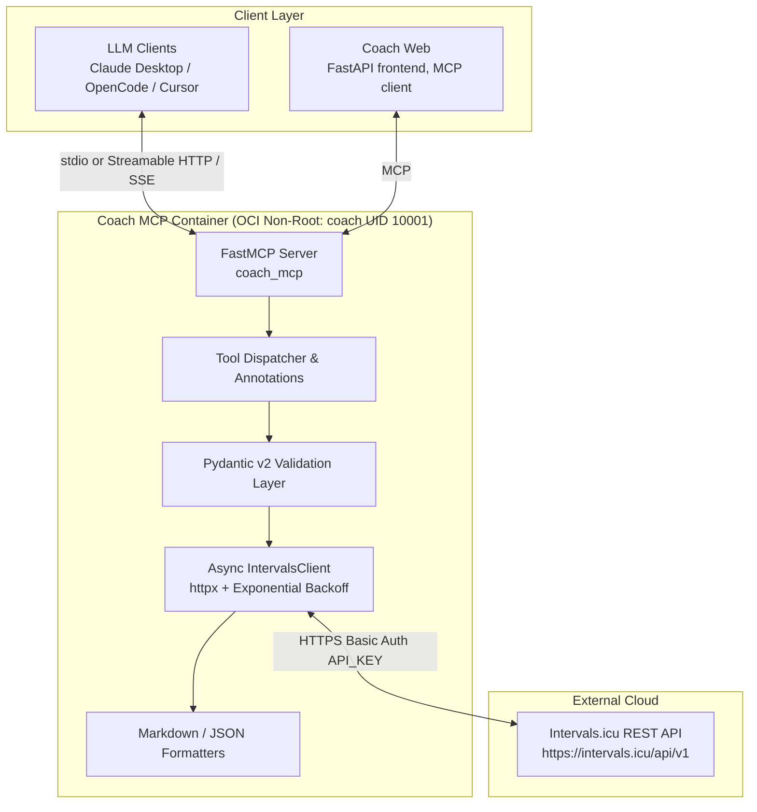

# Coach MCP Server 🚴‍♂️🏋️‍♂️

[](https://www.gnu.org/licenses/gpl-3.0)
[](https://www.python.org/downloads/)
[](https://modelcontextprotocol.io)
[-success.svg)](https://opencontainers.org)

**Coach MCP** is a production-grade Model Context Protocol (MCP) server that empowers Large Language Models (LLMs) to act as intelligent, data-driven endurance sports coaches by interacting seamlessly with the **Intervals.icu** REST API. It exposes 20 tools covering athlete profiling, activity analytics, wellness tracking, fitness metrics (Banister CTL/ATL/TSB), and structured workout planning.

> **📖 New to Coach MCP? Start with the [User Guide](docs/user_guide.md) for complete setup, deployment, and client integration instructions.**

---

## 🏛️ Architecture


```mermaid
graph TD
    subgraph "Client Layer"
        LLM[LLM Clients<br/>Claude Desktop / OpenCode / Cursor]
        COACH_WEB[Coach Web<br/>FastAPI frontend, MCP client]
    end

    subgraph "Coach MCP Container (OCI Non-Root: coach UID 10001)"
        MCP_SERVER[FastMCP Server<br/>coach_mcp]
        DISPATCH[Tool Dispatcher & Annotations]
        PYDANTIC[Pydantic v2 Validation Layer]
        CLIENT[Async IntervalsClient<br/>httpx + Exponential Backoff]
        FORMATTER[Markdown / JSON Formatters]

        MCP_SERVER --> DISPATCH
        DISPATCH --> PYDANTIC
        PYDANTIC --> CLIENT
        CLIENT --> FORMATTER
    end

    subgraph "External Cloud"
        INTERVALS[Intervals.icu REST API<br/>https://intervals.icu/api/v1]
    end

    LLM <-->|stdio or Streamable HTTP / SSE| MCP_SERVER
    COACH_WEB <-->|MCP| MCP_SERVER
    CLIENT <-->|HTTPS Basic Auth API_KEY| INTERVALS
```

---

## 📖 Documentation

All documentation lives in `docs/` — the README links, it never duplicates:

- **[User Guide](docs/user_guide.md)** — Complete setup, configuration, deployment (local, Docker, Compose, GHCR), client integration (Claude Desktop, OpenCode, Cursor, generic MCP), the full 20-tool catalog, workout DSL guide, and troubleshooting.
- **[Contributing](CONTRIBUTING.md)** — Governance (FPITTELO PROJECT STANDARD v1), local pre-flight, and PR protocol.
- **[Changelog](CHANGELOG.md)** — Release history (Keep a Changelog).

---

## 🚀 Quick Start

```bash
# Pull the production image and run in stdio mode
docker run -i --rm \
  -e INTERVALS_API_KEY="your_api_key" \
  -e INTERVALS_ATHLETE_ID="0" \
  ghcr.io/fpittelo/coach:latest
```

For HTTP/SSE deployment, Docker Compose, local Python setup, environment-variable reference, and client configuration, see the [User Guide](docs/user_guide.md).

---

## 📄 License

This project is licensed under the **GNU General Public License v3.0 or later (GPL-3.0-or-later)**. See the [LICENSE](LICENSE) file for details.
