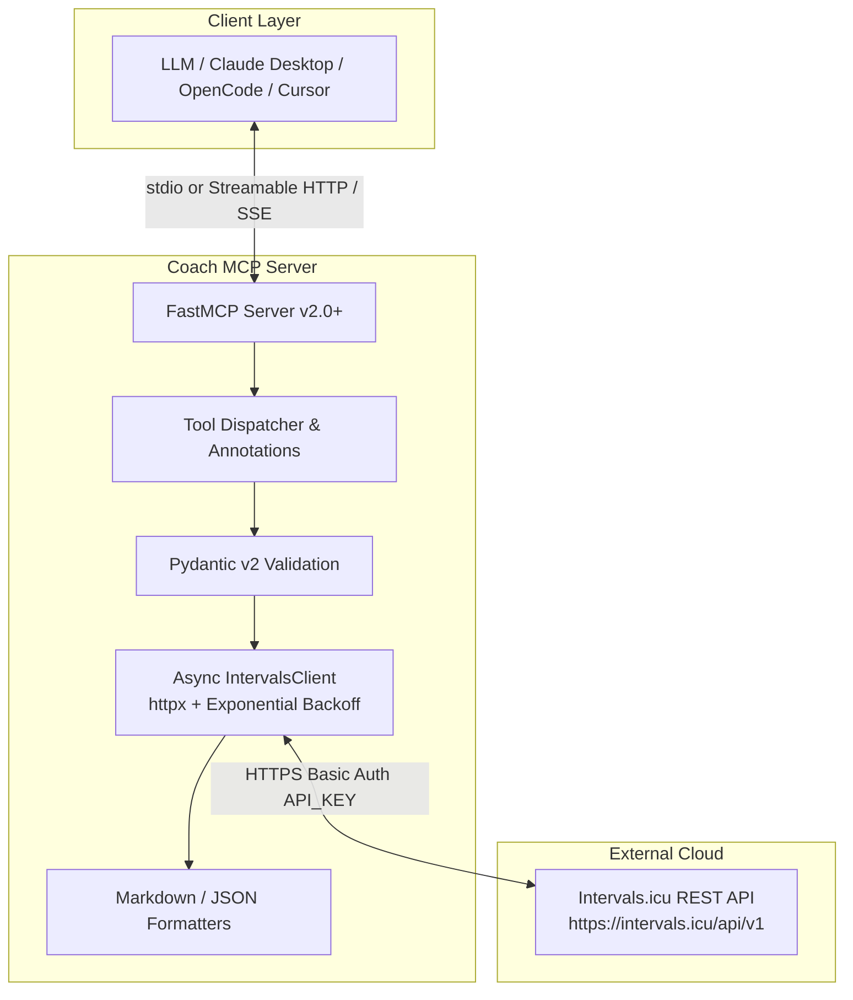

# Coach MCP Server — User Guide

> **Version**: 0.1.0  
> **Scope**: Setup, configure, deploy, and connect the Coach MCP Server to Intervals.icu and your favourite LLM client.  
> **Companion**: See [`README.md`](../README.md) for project overview, architecture diagram, and quick-start snippets.

---

## Table of Contents

1. [System Overview & Architecture](#1-system-overview--architecture)
2. [Prerequisites](#2-prerequisites)
3. [Configuration Reference](#3-configuration-reference)
4. [Deployment Methods](#4-deployment-methods)
5. [Client Integration Guides](#5-client-integration-guides)
6. [Complete Tool Catalog](#6-complete-tool-catalog)
7. [Intervals.icu Workout DSL Guide](#7-intervalsicu-workout-dsl-guide)
8. [Troubleshooting & Operational Best Practices](#8-troubleshooting--operational-best-practices)

---

## 1. System Overview & Architecture

**Coach MCP** is a production-grade [Model Context Protocol (MCP)](https://modelcontextprotocol.io) server written in Python 3.11+. It exposes 19 tools that let an LLM (Claude, OpenCode, Cursor, etc.) read and write endurance-sports data through the [Intervals.icu](https://intervals.icu) REST API.



### Key design points

- **MCP Python SDK v2.0+** — `MCPServer` with strongly-typed Pydantic inputs, `ToolAnnotations`, and lifespan-managed HTTP client.
- **Dual transport** — `stdio` for local desktop clients; `streamable_http` / `sse` for remote or containerised deployments.
- **Resilient HTTP client** — Exponential backoff with `Retry-After` honouring for HTTP 429 and 5xx errors.
- **Clean stdio channel** — All logs are written to `stderr`; `stdout` is reserved for JSON-RPC framing.
- **Non-root OCI container** — Runs as `coach:coach` (`UID:GID 10001:10001`).
- **Markdown or JSON output** — Every read tool supports `response_format: markdown | json`.

---

## 2. Prerequisites

### 2.1 Intervals.icu account

You need an active [Intervals.icu](https://intervals.icu) account with at least one athlete profile.

### 2.2 API key

1. Log in to Intervals.icu.
2. Go to **Settings** → **Developer Settings** (near the bottom).
3. Generate an **API key**.
4. Copy and store it securely — it is the password used for HTTP Basic Auth.

> **Security note**: Treat the API key like a password. Rotate it immediately if it is exposed.

### 2.3 Athlete ID resolution

| Value | Meaning |
| :--- | :--- |
| `0` | The athlete associated with the API key (yourself). |
| `iXXXXX` | A coached athlete (e.g., `i123456`). |
| Numeric ID | Direct Intervals.icu athlete identifier (e.g., `2049151`). |

Set `INTERVALS_ATHLETE_ID=0` for personal use. For coached athletes, use their Intervals.icu athlete ID.

### 2.4 Runtime requirements

- Python **3.11+** for local installation.
- Or [Docker](https://docs.docker.com/get-docker/) / [Docker Compose](https://docs.docker.com/compose/) for containerised deployment.

---

## 3. Configuration Reference

Coach MCP is configured entirely through environment variables. Create a `.env` file in the project root or export variables directly.

| Variable | Description | Default |
| :--- | :--- | :--- |
| `INTERVALS_API_KEY` | **Required.** Your Intervals.icu API key. | — |
| `INTERVALS_ATHLETE_ID` | Athlete ID (`0` for self, `iXXXXX` for coached athlete). | `0` |
| `INTERVALS_BASE_URL` | Intervals.icu API base URL. | `https://intervals.icu/api/v1` |
| `MCP_TRANSPORT` | Transport mode: `stdio`, `streamable_http`, `streamable-http`, or `sse`. | `stdio` |
| `MCP_HOST` | Host to bind for HTTP / SSE transport. | `0.0.0.0` |
| `MCP_PORT` | Port to bind for HTTP / SSE transport. | `8000` |
| `HTTP_TIMEOUT_SECONDS` | HTTP request timeout in seconds. | `30.0` |
| `HTTP_MAX_RETRIES` | Maximum retry attempts on 429 / 5xx / network errors. | `3` |

### Example `.env` file

```bash
# Intervals.icu API Configuration
INTERVALS_API_KEY=your_api_key_here
INTERVALS_ATHLETE_ID=0
INTERVALS_BASE_URL=https://intervals.icu/api/v1

# MCP Transport Configuration
MCP_TRANSPORT=stdio
MCP_HOST=0.0.0.0
MCP_PORT=8000

# HTTP Client Behaviour
HTTP_TIMEOUT_SECONDS=30.0
HTTP_MAX_RETRIES=3
```

### Notes

- `MCP_TRANSPORT` accepts both `streamable_http` (underscore) and `streamable-http` (hyphen) for convenience.
- For stdio clients (Claude Desktop, OpenCode), keep `MCP_TRANSPORT=stdio`.
- For remote HTTP/SSE clients, set `MCP_TRANSPORT=streamable_http` and expose `MCP_PORT`.

---

## 4. Deployment Methods

### 4.1 Local Python environment

#### Using `uv` (recommended)

```bash
# Clone the repository
git clone https://github.com/fpittelo/coach.git
cd coach

# Create virtual environment and install
uv venv --python 3.11
source .venv/bin/activate
uv pip install -e ".[dev]"

# Run the server
INTERVALS_API_KEY="your_api_key" INTERVALS_ATHLETE_ID="0" coach-mcp
```

#### Using `pip`

```bash
python -m venv .venv
source .venv/bin/activate
pip install -e ".[dev]"

# Run via installed CLI
coach-mcp

# Or run the module directly
python -m coach_mcp.server
```

#### Verify the installation

```bash
# Run linting
ruff check .

# Run tests
pytest -v --cov=src/coach_mcp tests/
```

### 4.2 Docker container

Pre-built images are published to the GitHub Container Registry:

| Trigger | Tag |
| :--- | :--- |
| Push to `dev` | `ghcr.io/fpittelo/coach:dev` |
| PR merged to `qa` | `ghcr.io/fpittelo/coach:qa` |
| PR merged to `main` | `ghcr.io/fpittelo/coach:latest`, `ghcr.io/fpittelo/coach:prod` |
| Specific commit | `ghcr.io/fpittelo/coach:<sha>` |

#### Pull and run (stdio)

```bash
docker pull ghcr.io/fpittelo/coach:latest

docker run -i --rm \
  -e INTERVALS_API_KEY="your_api_key" \
  -e INTERVALS_ATHLETE_ID="0" \
  ghcr.io/fpittelo/coach:latest
```

#### Run with Streamable HTTP / SSE

```bash
docker run -d --rm \
  -p 8000:8000 \
  -e MCP_TRANSPORT="streamable_http" \
  -e MCP_PORT="8000" \
  -e INTERVALS_API_KEY="your_api_key" \
  -e INTERVALS_ATHLETE_ID="0" \
  --name coach-mcp-server \
  ghcr.io/fpittelo/coach:latest
```

#### Build locally

```bash
docker build -t coach-mcp .
docker run -i --rm -e INTERVALS_API_KEY="your_api_key" coach-mcp
```

#### Security: non-root execution

The container runs as an unprivileged user:

```dockerfile
RUN groupadd -g 10001 coach && \
    useradd -u 10001 -g coach -s /bin/false -m -d /home/coach coach
USER coach:coach
```

Do not override `USER` to `root` in production; doing so violates the OCI non-root security model.

### 4.3 Docker Compose

Create a `compose.yaml` file next to your project:

```yaml
services:
  coach-mcp:
    image: ghcr.io/fpittelo/coach:latest
    container_name: coach-mcp
    restart: unless-stopped
    ports:
      - "8000:8000"
    environment:
      - INTERVALS_API_KEY=${INTERVALS_API_KEY}
      - INTERVALS_ATHLETE_ID=${INTERVALS_ATHLETE_ID:-0}
      - INTERVALS_BASE_URL=${INTERVALS_BASE_URL:-https://intervals.icu/api/v1}
      - MCP_TRANSPORT=${MCP_TRANSPORT:-streamable_http}
      - MCP_HOST=${MCP_HOST:-0.0.0.0}
      - MCP_PORT=${MCP_PORT:-8000}
      - HTTP_TIMEOUT_SECONDS=${HTTP_TIMEOUT_SECONDS:-30.0}
      - HTTP_MAX_RETRIES=${HTTP_MAX_RETRIES:-3}
    read_only: true
    user: "10001:10001"
    security_opt:
      - no-new-privileges:true
    cap_drop:
      - ALL
```

Start the service:

```bash
# Ensure .env exists with your variables
docker compose up -d
```

For a read-only root filesystem, the image writes only to `/tmp` (if needed) and keeps the application in `/app`.

---

## 5. Client Integration Guides

### 5.1 Claude Desktop

Edit your `claude_desktop_config.json`:

- **macOS**: `~/Library/Application Support/Claude/claude_desktop_config.json`
- **Windows**: `%APPDATA%\Claude\claude_desktop_config.json`

#### Local Python stdio

```json
{
  "mcpServers": {
    "coach": {
      "command": "coach-mcp",
      "env": {
        "INTERVALS_API_KEY": "your_api_key_here",
        "INTERVALS_ATHLETE_ID": "0",
        "MCP_TRANSPORT": "stdio"
      }
    }
  }
}
```

#### Docker stdio

```json
{
  "mcpServers": {
    "coach": {
      "command": "docker",
      "args": [
        "run",
        "-i",
        "--rm",
        "-e", "INTERVALS_API_KEY=your_api_key_here",
        "-e", "INTERVALS_ATHLETE_ID=0",
        "-e", "MCP_TRANSPORT=stdio",
        "ghcr.io/fpittelo/coach:latest"
      ]
    }
  }
}
```

Restart Claude Desktop after editing. The Coach tools appear under the hammer 🔨 menu.

### 5.2 OpenCode

Add the server to your `opencode.json` (typically in `~/.config/opencode/opencode.json` or project root):

```json
{
  "mcpServers": {
    "coach": {
      "command": "coach-mcp",
      "args": [],
      "env": {
        "INTERVALS_API_KEY": "your_api_key_here",
        "INTERVALS_ATHLETE_ID": "0",
        "MCP_TRANSPORT": "stdio"
      },
      "description": "Intervals.icu endurance coaching data and workout planning"
    }
  }
}
```

For Docker stdio, replace `command`/`args` with the Docker invocation shown in the Claude Desktop section.

### 5.3 Cursor / Cline / Windsurf / Generic MCP clients

Most generic MCP clients accept the same `command` + `env` stdio configuration as Claude Desktop.

#### stdio configuration template

```json
{
  "mcpServers": {
    "coach": {
      "command": "coach-mcp",
      "env": {
        "INTERVALS_API_KEY": "your_api_key_here",
        "INTERVALS_ATHLETE_ID": "0",
        "MCP_TRANSPORT": "stdio"
      }
    }
  }
}
```

#### HTTP / SSE configuration template

If your client supports MCP over HTTP or SSE, point it at the running Coach server:

```text
URL: http://localhost:8000/mcp
Transport: streamable_http or sse
```

When running in Docker with `MCP_TRANSPORT=streamable_http` and port `8000` exposed, use:

```text
URL: http://localhost:8000/mcp
```

> **Note**: Not all clients support streamable HTTP or SSE. Claude Desktop currently uses stdio only. Cursor, Cline, and Windsurf support varies by version; consult their MCP documentation.

---

## 6. Complete Tool Catalog

Coach exposes **19 tools** grouped into six categories. All read tools support `response_format: markdown | json`.

### 6.1 Athlete Profiling

| Tool | Description | Sample Input | Sample Output |
| :--- | :--- | :--- | :--- |
| `intervals_get_athlete_profile` | Athlete name, weight, resting HR, max HR, location. | `{"athlete_id": "0", "response_format": "markdown"}` | Markdown profile summary or raw JSON. |
| `intervals_get_sport_settings` | FTP, LTHR, max HR, power zones, HR zones per sport. | `{"athlete_id": "0", "response_format": "markdown"}` | Sport settings table with zones. |

### 6.2 Activities

| Tool | Description | Sample Input | Sample Output |
| :--- | :--- | :--- | :--- |
| `intervals_list_activities` | List workouts in a date range with duration, distance, power, HR, TSS. | `{"oldest": "2026-08-01", "newest": "2026-08-22", "limit": 50}` | Markdown table of activities. |
| `intervals_get_activity` | Detailed metrics: NP, IF, TSS, training effects, RPE, feel. | `{"activity_id": "i12345678"}` | Detailed activity report. |
| `intervals_get_activity_streams` | Second-by-second sensor streams (watts, HR, cadence, altitude, etc.). | `{"activity_id": "i12345678", "types": ["watts", "heartrate"]}` | Stream metadata + first data points. |
| `intervals_get_activity_intervals` | Detected work/recovery intervals with power, HR, cadence. | `{"activity_id": "i12345678"}` | JSON array of intervals. |
| `intervals_create_activity` | Manually record a completed workout. | `{"name": "Morning Ride", "type": "Ride", "start_date_local": "2026-08-22T07:00:00", "moving_time_seconds": 3600}` | Success message with created activity ID. |
| `intervals_update_activity` | Update title, feel, RPE, training load, notes. | `{"activity_id": "i12345678", "feel": 2, "perceived_exertion": 7.5}` | Success confirmation. |
| `intervals_delete_activity` | Permanently delete an activity. ⚠️ Destructive. | `{"activity_id": "i12345678"}` | Success confirmation. |

### 6.3 Wellness / Recovery

| Tool | Description | Sample Input | Sample Output |
| :--- | :--- | :--- | :--- |
| `intervals_get_wellness` | Daily resting HR, HRV, sleep, readiness, fatigue, soreness. | `{"oldest": "2026-08-01", "newest": "2026-08-22"}` | Wellness table. |
| `intervals_record_wellness` | Record or update daily wellness metrics. | `{"date": "2026-08-22", "restingHR": 48, "readiness": 85.5}` | Success confirmation. |

### 6.4 Fitness / Banister model

| Tool | Description | Sample Input | Sample Output |
| :--- | :--- | :--- | :--- |
| `intervals_get_fitness_summary` | CTL (Fitness), ATL (Fatigue), TSB (Form) summary and trend. | `{"oldest": "2026-08-01", "newest": "2026-08-22"}` | Fitness status + 7-day trend table. |

### 6.5 Calendar Events

| Tool | Description | Sample Input | Sample Output |
| :--- | :--- | :--- | :--- |
| `intervals_list_events` | Scheduled workouts, notes, race targets in a date range. | `{"oldest": "2026-08-01", "newest": "2026-08-22", "category": "WORKOUT"}` | Events table. |
| `intervals_get_event` | Full event details including structured workout DSL. | `{"event_id": "evt_12345"}` | Event header + DSL block. |
| `intervals_create_event` | Schedule a new workout or calendar event. | `{"start_date_local": "2026-08-23T08:00:00", "name": "VO2max 4x4", "type": "Ride", "category": "WORKOUT", "workout_doc": "- 10m warmup\n4x\n- 4m 115%\n- 3m 50%\n- 10m cooldown"}` | Success with event ID. |
| `intervals_update_event` | Update date, title, description, or DSL steps. | `{"event_id": "evt_12345", "name": "Updated Workout"}` | Success confirmation. |
| `intervals_delete_event` | Delete a scheduled event. ⚠️ Destructive. | `{"event_id": "evt_12345"}` | Success confirmation. |

### 6.6 Workout Library

| Tool | Description | Sample Input | Sample Output |
| :--- | :--- | :--- | :--- |
| `intervals_list_folders` | Custom folders organising workout templates. | `{}` | Folder list with item counts. |
| `intervals_list_workouts` | Reusable workout templates, optionally filtered by folder. | `{"folder_id": "folder_abc123"}` | Workout template list. |

---

## 7. Intervals.icu Workout DSL Guide

Planned workouts are created with the `intervals_create_event` tool using the `workout_doc` field. The `workout_doc` is plain text written in the Intervals.icu native workout description language. Intervals.icu parses this text into structured steps, calculates training load, and can export the workout to Garmin Connect, Wahoo, or Zwift.

### 7.1 Syntax rules

| Rule | Format | Example |
| :--- | :--- | :--- |
| **H** — Header / section name | Plain text line | `Warmup` |
| **O** — One step per line | Each step starts with `-` | `- 10m 50%` |
| **M** — Multiplier / repeat block | `Nx` followed by indented steps | `3x` then `- 2m 105%` |
| **E** — End with cooldown | Final section is recovery | `Cooldown` |
| Duration | `h`, `m`, `s` | `5m`, `30s`, `1h` |
| Power target | `%ftp` or absolute `W` | `85%`, `200W` |
| Power range | Use a hyphen | `50-65%`, `200-250W` |
| Cadence | Append `rpm` | `90rpm` |
| Ramp | Use the `ramp` keyword | `10m ramp 60%-90%` |
| Zone | Use `Z1`–`Z7` | `5m Z2` |

### 7.2 HOME Rule #6 — Explicit wattage targets

When you know the athlete's FTP, prefer explicit wattage values over percentages for precision. Rule #6 states:

> **Use absolute watts (`W`) for fixed targets when the exact load must be preserved regardless of FTP changes.**

This is especially useful for:

- Indoor trainer workouts where the trainer receives absolute targets.
- Prescribing workouts for athletes whose FTP is updated frequently.
- Sharing workouts between athletes with different FTPs while keeping the same absolute stimulus.

#### Example: 4-phase workout with explicit wattage

```text
Warm-up
- 10m 150W 90rpm

Work Intervals
5x
- 3m 250W 100rpm
- 2m 150W 85rpm

Rest
- 5m 120W 80rpm

Wind-down
- 10m ramp 150W-100W 85rpm
```

#### JSON payload for `intervals_create_event`

```json
{
  "start_date_local": "2026-08-23T08:00:00",
  "name": "Threshold 5x3min (Explicit Watts)",
  "type": "Ride",
  "category": "WORKOUT",
  "description": "5 x 3 min threshold intervals with explicit wattage targets.",
  "workout_doc": "Warm-up\n- 10m 150W 90rpm\n\nWork Intervals\n5x\n- 3m 250W 100rpm\n- 2m 150W 85rpm\n\nRest\n- 5m 120W 80rpm\n\nWind-down\n- 10m ramp 150W-100W 85rpm",
  "moving_time_seconds": 3300,
  "icu_training_load": 95
}
```

### 7.3 Additional examples

#### Percentage-based VO2max intervals

```text
Warmup
- 10m 50-65% 90rpm

Main Set
4x
- 4m 115% 100rpm
- 3m 50% 85rpm

Cooldown
- 10m 50-40% 80rpm
```

#### Sweet-spot with cadence variations

```text
Warmup
- 12m ramp 50%-75% 85rpm

Main Set
- 10m 88% 85rpm
- 5m 88% 70rpm
- 10m 88% 90rpm
- 5m Z1 85rpm

Cooldown
- 8m 50%-40% 80rpm
```

---

## 8. Troubleshooting & Operational Best Practices

### 8.1 Authentication errors (401 / 403)

**Symptom**: `Authentication failed (401). Check INTERVALS_API_KEY.`

**Resolution**:

1. Verify `INTERVALS_API_KEY` is set and matches the key in **Settings → Developer Settings**.
2. Ensure there are no trailing spaces or newline characters.
3. Regenerate the key if it was revoked or exposed.
4. Confirm the athlete ID is valid and accessible with the API key.

### 8.2 Rate limiting (429)

**Symptom**: `Intervals.icu rate limit exceeded. Please wait before retrying.`

**Resolution**:

- Coach MCP automatically retries on HTTP 429 using the `Retry-After` header with exponential backoff.
- If retries are exhausted, wait and retry the request later.
- Reduce request frequency; Intervals.icu limits API-key callers to **5000 requests/day** and **2500 requests per 15-minute window**.
- Avoid polling in tight loops; cache results where possible.

### 8.3 stdio logging clean framing

**Symptom**: MCP client reports malformed JSON-RPC messages.

**Resolution**:

- Coach MCP logs exclusively to `stderr`; `stdout` is reserved for JSON-RPC.
- Do not run the server with `PYTHONUNBUFFERED=0` in a way that redirects `stderr` to `stdout`.
- When debugging, capture `stderr` separately:

```bash
coach-mcp 2> coach-mcp.log
```

### 8.4 Docker networking

**Symptom**: HTTP/SSE client cannot reach the container.

**Resolution**:

- Ensure `MCP_TRANSPORT=streamable_http` and the container port is published (`-p 8000:8000`).
- Verify the host firewall allows traffic on the exposed port.
- For Docker Compose, confirm the service is healthy: `docker compose ps`.

### 8.5 Timeouts on large requests

**Symptom**: `Connection timeout or network failure`.

**Resolution**:

- Increase `HTTP_TIMEOUT_SECONDS` for large activity stream requests.
- Reduce the date range or activity limit to keep responses smaller.
- Check network connectivity to `https://intervals.icu`.

### 8.6 General best practices

- **Use `.env` files** for local development, but never commit secrets.
- **Pin image tags** in production (`ghcr.io/fpittelo/coach:prod` or a SHA) instead of `latest`.
- **Run as non-root** in containers; the image already uses `UID 10001`.
- **Keep dependencies updated** by rebuilding the image after `pyproject.toml` changes.
- **Monitor rate-limit headers** returned by Intervals.icu (`X-RateLimit-Remaining`) if building automation.

---

## Quick reference card

```bash
# Local stdio
coach-mcp

# Local HTTP
coach-mcp   # with MCP_TRANSPORT=streamable_http

# Docker stdio
docker run -i --rm -e INTERVALS_API_KEY=... ghcr.io/fpittelo/coach:latest

# Docker HTTP
docker run -d --rm -p 8000:8000 -e MCP_TRANSPORT=streamable_http -e INTERVALS_API_KEY=... ghcr.io/fpittelo/coach:latest

# Lint & test
ruff check .
pytest -v --cov=src/coach_mcp tests/
```

---

*For development details, architecture, and contribution guidelines, see [`README.md`](../README.md).*
